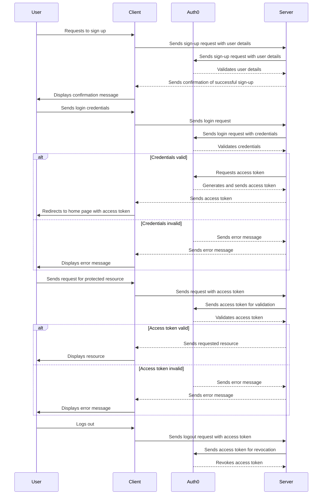
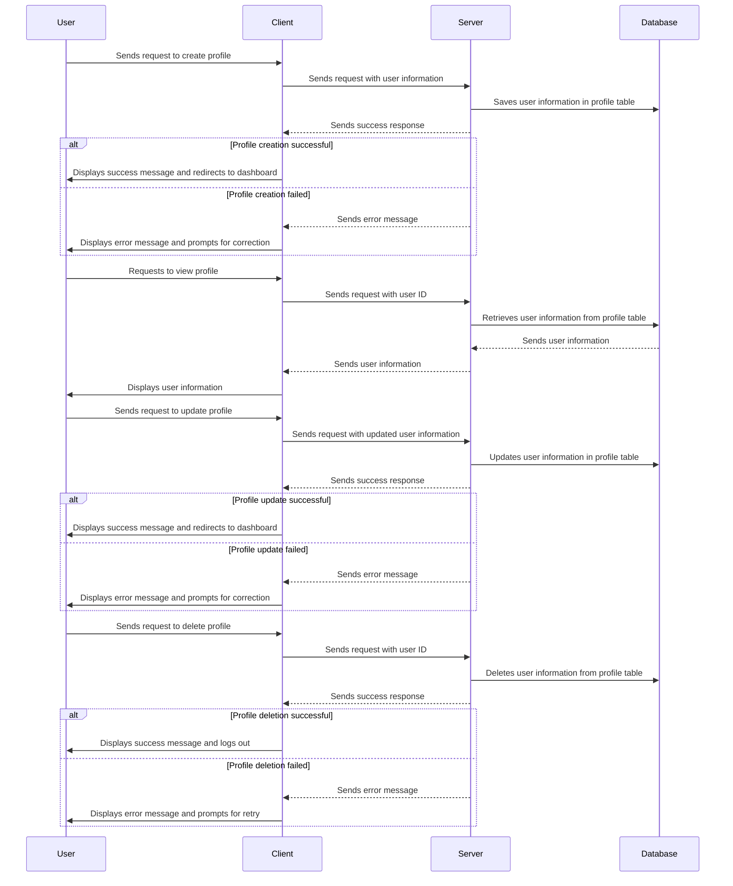

# fitness-app

Sign up & Sign in flow:

```mermaid
sequenceDiagram
    participant User
    participant Client
    participant Auth0
    participant Server
    User->>Client: Requests to sign up
    Client->>Server: Sends sign-up request with user details
    Server->>Auth0: Sends sign-up request with user details
    Auth0-->>Server: Validates user details
    Server-->>Client: Sends confirmation of successful sign-up
    Client->>User: Displays confirmation message
    User->>Client: Sends login credentials
    Client->>Server: Sends login request
    Server->>Auth0: Sends login request with credentials
    Auth0-->>Server: Validates credentials
    alt Credentials valid
        Server->>Auth0: Requests access token
        Auth0-->>Server: Generates and sends access token
        Server-->>Client: Sends access token
        Client->>User: Redirects to home page with access token
    else Credentials invalid
        Auth0-->>Server: Sends error message
        Server-->>Client: Sends error message
        Client->>User: Displays error message
    end
    User->>Client: Sends request for protected resource
    Client->>Server: Sends request with access token
    Server->>Auth0: Sends access token for validation
    Auth0-->>Server: Validates access token
    alt Access token valid
        Server-->>Client: Sends requested resource
        Client->>User: Displays resource
    else Access token invalid
        Auth0-->>Server: Sends error message
        Server-->>Client: Sends error message
        Client->>User: Displays error message
    end
    User->>Client: Logs out
    Client->>Server: Sends logout request with access token
    Server->>Auth0: Sends access token for revocation
    Auth0-->>Server: Revokes access token
```

Profile CRUD flow

```mermaid
sequenceDiagram
    participant User
    participant Client
    participant Server
    participant Database
    User->>Client: Sends request to create profile
    Client->>Server: Sends request with user information
    Server->>Database: Saves user information in profile table
    Server-->>Client: Sends success response
    alt Profile creation successful
        Client->>User: Displays success message and redirects to dashboard
    else Profile creation failed
        Server-->>Client: Sends error message
        Client->>User: Displays error message and prompts for correction
    end
    User->>Client: Requests to view profile
    Client->>Server: Sends request with user ID
    Server->>Database: Retrieves user information from profile table
    Database-->>Server: Sends user information
    Server-->>Client: Sends user information
    Client->>User: Displays user information
    User->>Client: Sends request to update profile
    Client->>Server: Sends request with updated user information
    Server->>Database: Updates user information in profile table
    Server-->>Client: Sends success response
    alt Profile update successful
        Client->>User: Displays success message and redirects to dashboard
    else Profile update failed
        Server-->>Client: Sends error message
        Client->>User: Displays error message and prompts for correction
    end
    User->>Client: Sends request to delete profile
    Client->>Server: Sends request with user ID
    Server->>Database: Deletes user information from profile table
    Server-->>Client: Sends success response
    alt Profile deletion successful
        Client->>User: Displays success message and logs out
    else Profile deletion failed
        Server-->>Client: Sends error message
        Client->>User: Displays error message and prompts for retry
    end
```
