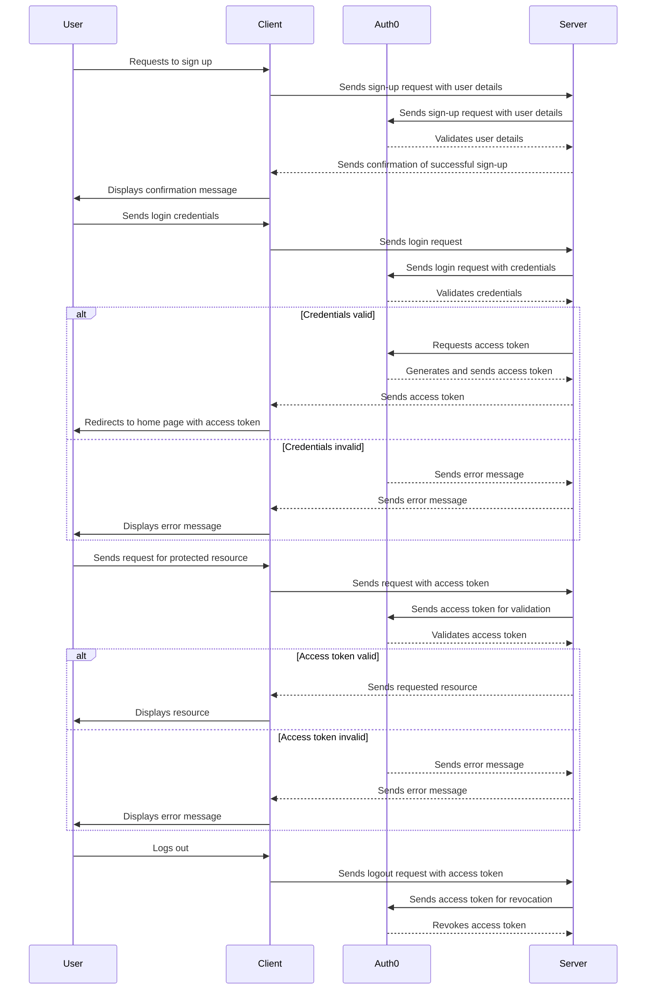
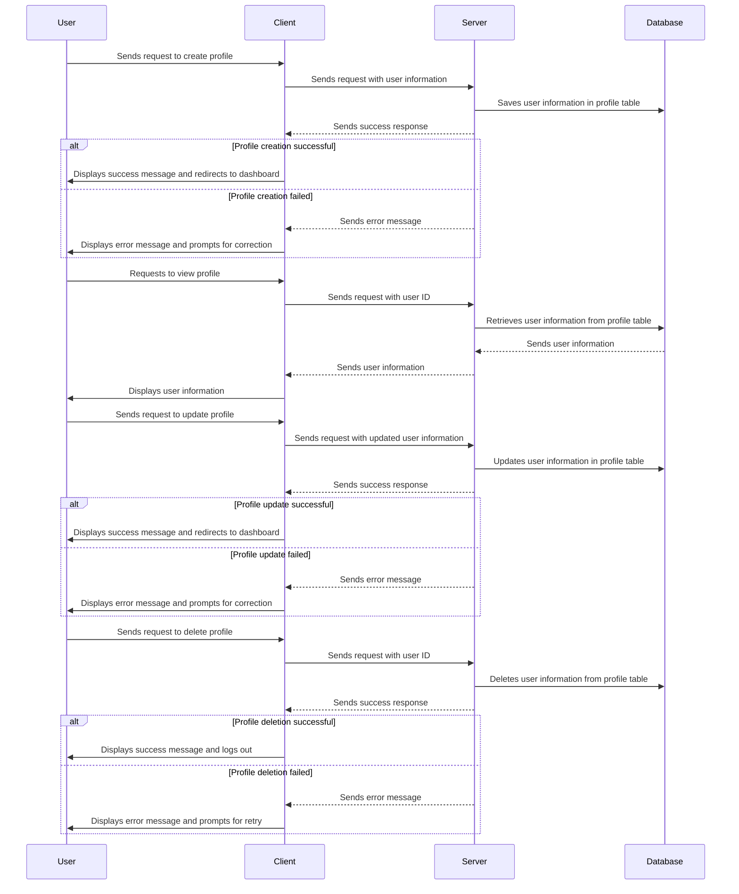
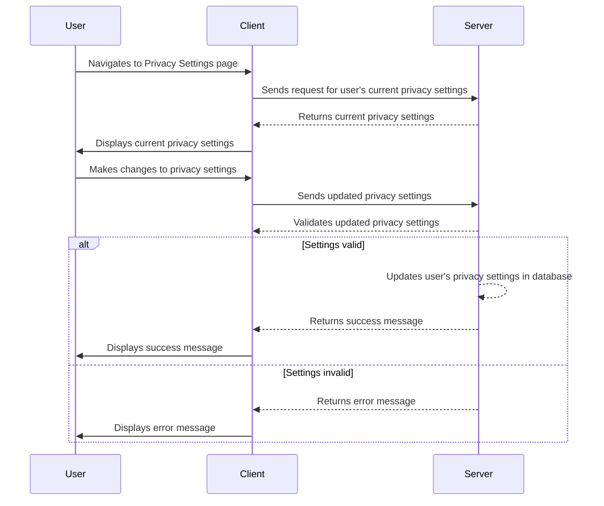
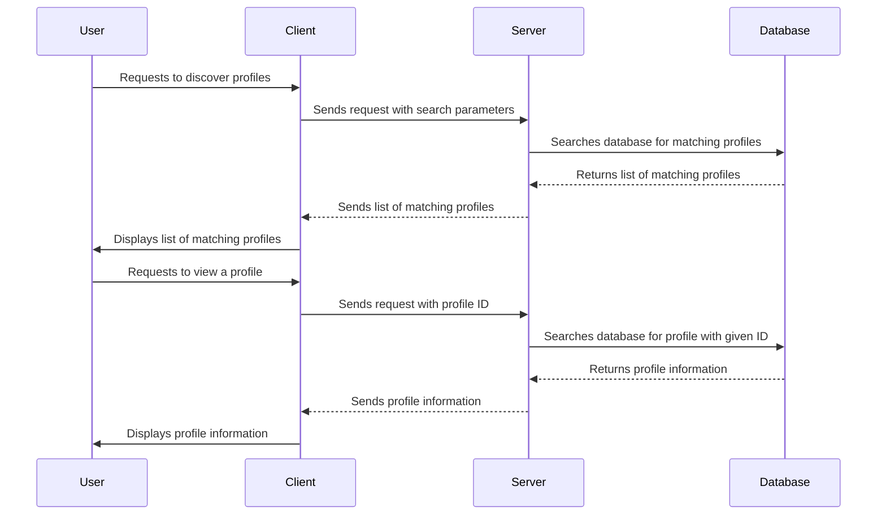
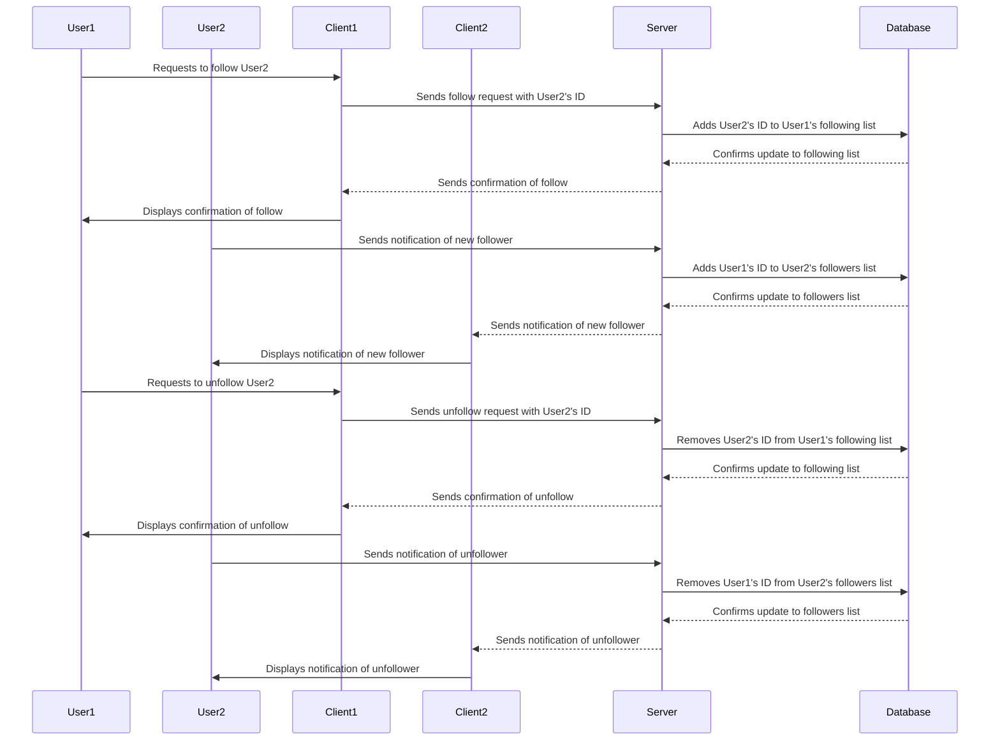
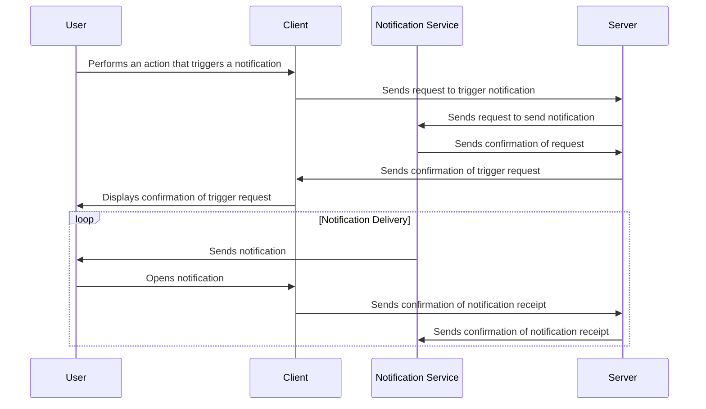
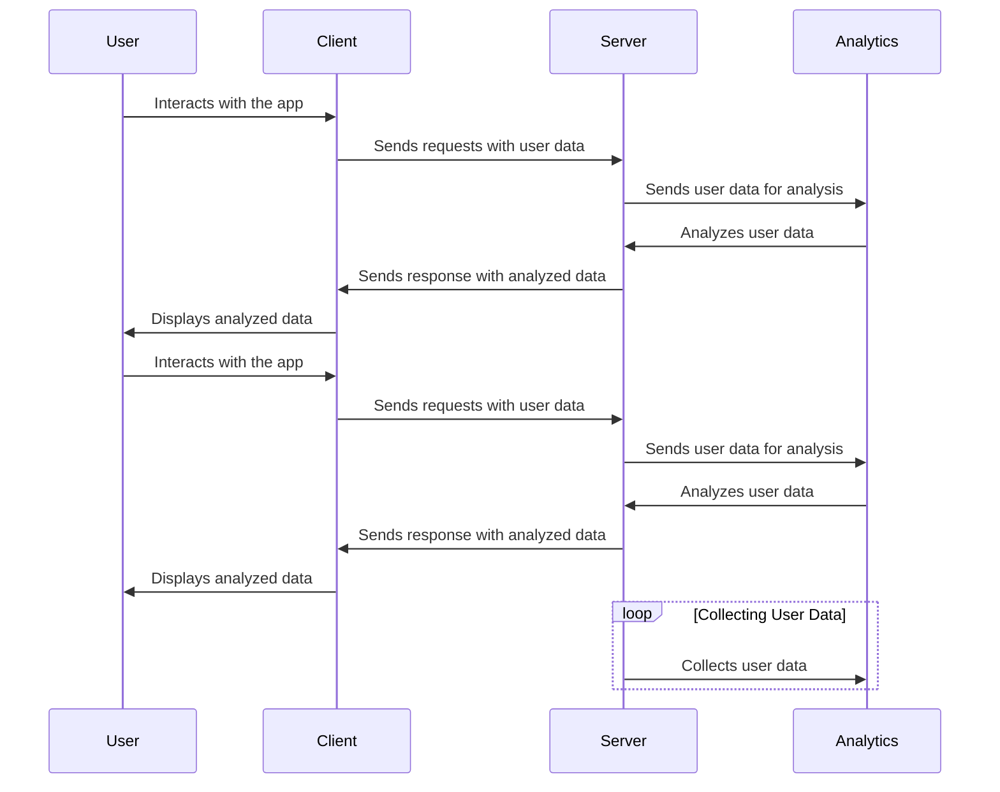
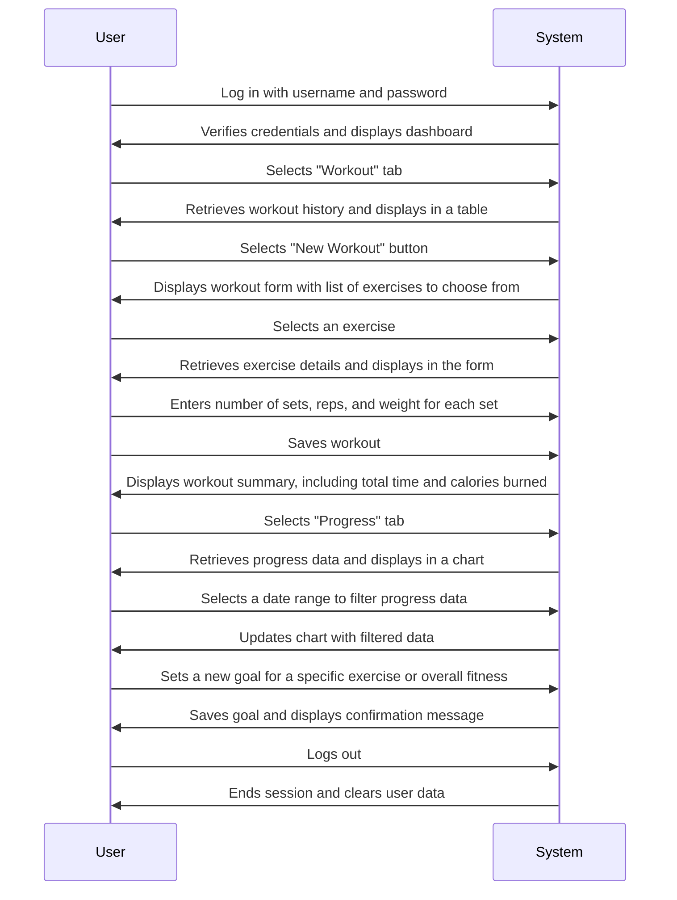
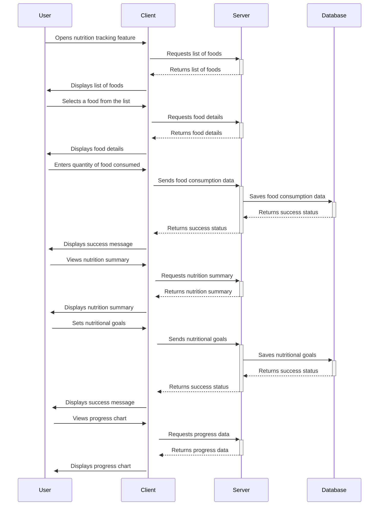
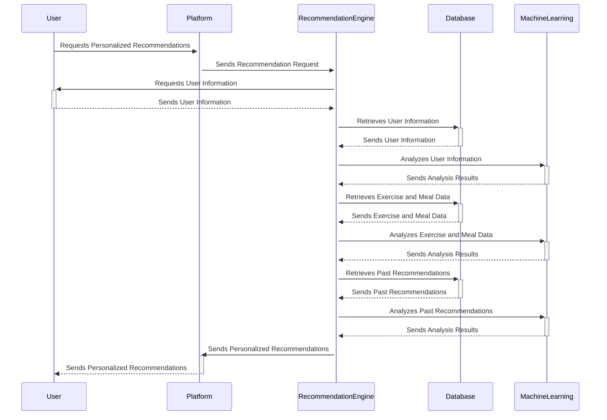

# fitness-app

Sign up & Sign in flow:

Profile CRUD flow

Privacy Settings

Profile Discovery

Profile Follow/ Unfollow 

User Notification

User Analytics

Workout Tracking

Nutrition Tracking

Personalized Recommendation

