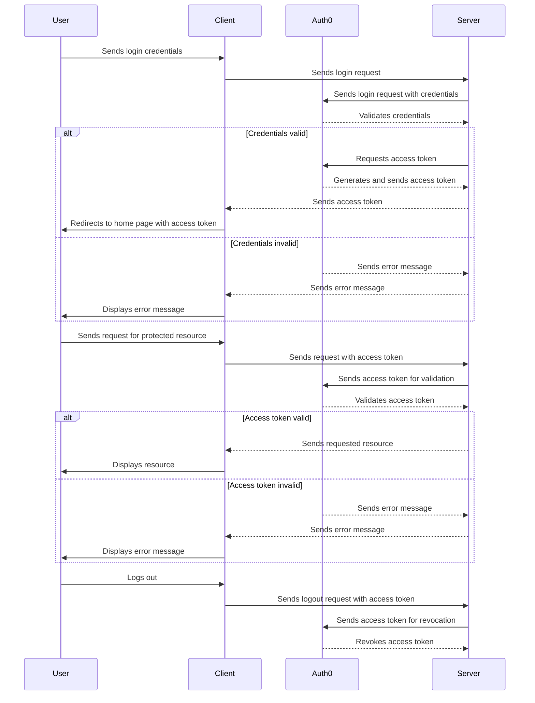

# fitness-app

Sign in flow:


```mermaid
sequenceDiagram
    participant User
    participant Client
    participant Auth0
    participant Server
    User->>Client: Sends login credentials
    Client->>Server: Sends login request
    Server->>Auth0: Sends login request with credentials
    Auth0-->>Server: Validates credentials
    alt Credentials valid
        Server->>Auth0: Requests access token
        Auth0-->>Server: Generates and sends access token
        Server-->>Client: Sends access token
        Client->>User: Redirects to home page with access token
    else Credentials invalid
        Auth0-->>Server: Sends error message
        Server-->>Client: Sends error message
        Client->>User: Displays error message
    end
    User->>Client: Sends request for protected resource
    Client->>Server: Sends request with access token
    Server->>Auth0: Sends access token for validation
    Auth0-->>Server: Validates access token
    alt Access token valid
        Server-->>Client: Sends requested resource
        Client->>User: Displays resource
    else Access token invalid
        Auth0-->>Server: Sends error message
        Server-->>Client: Sends error message
        Client->>User: Displays error message
    end
    User->>Client: Logs out
    Client->>Server: Sends logout request with access token
    Server->>Auth0: Sends access token for revocation
    Auth0-->>Server: Revokes access token
```

Sign up flow

```mermaid
```
